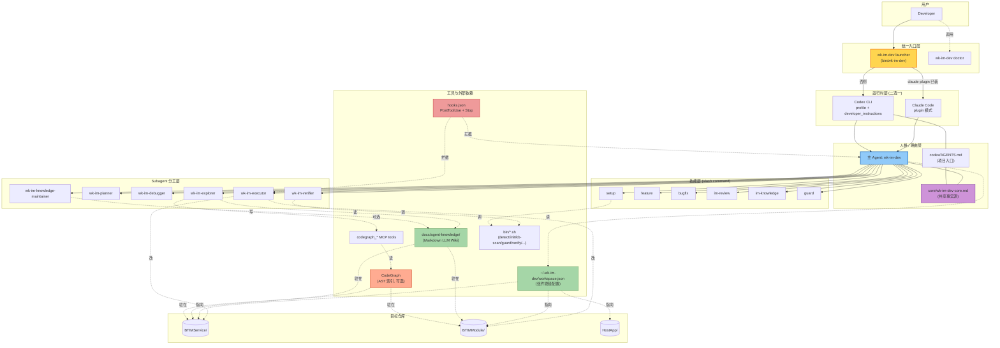
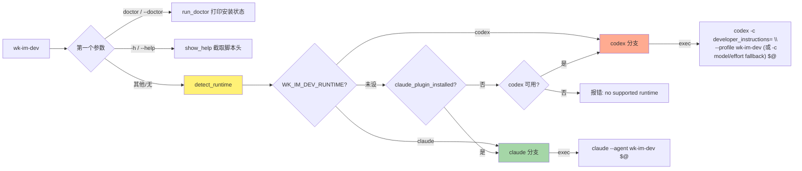
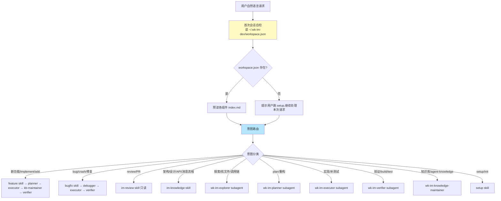
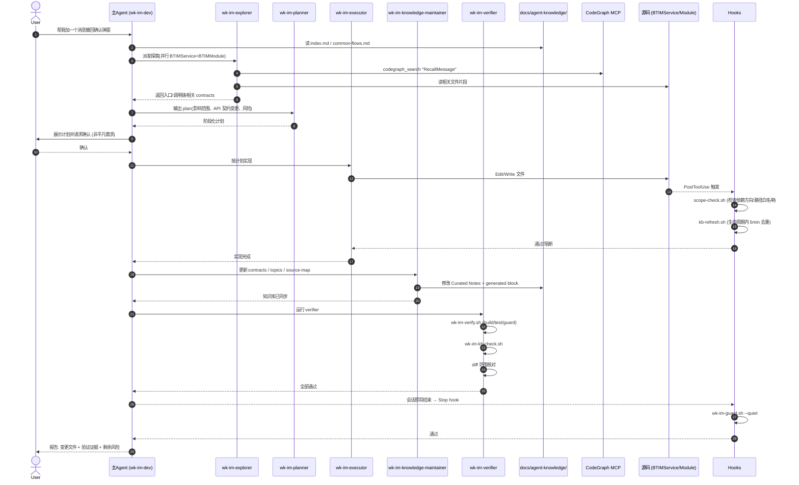
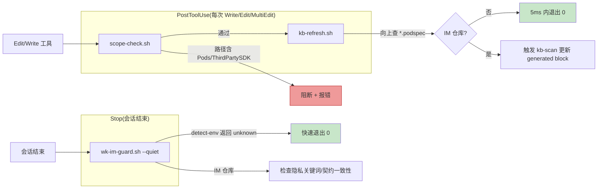
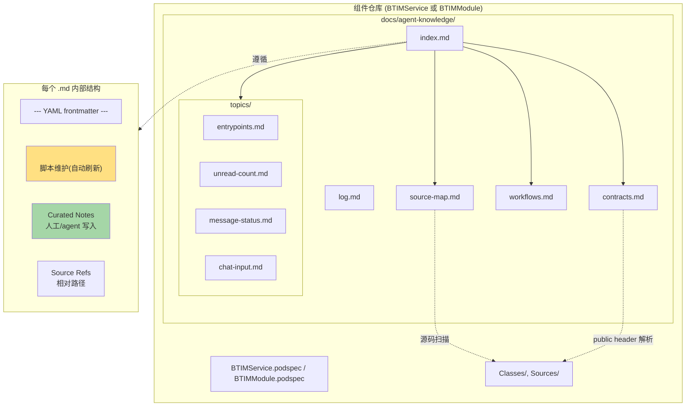
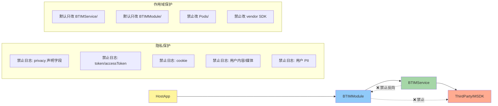
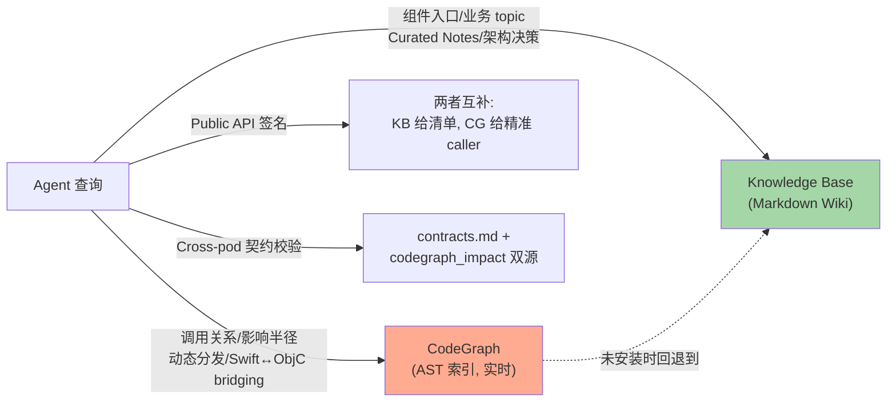
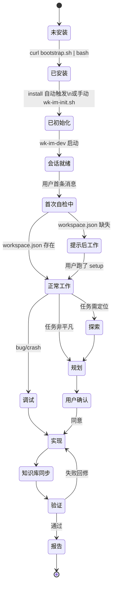

# wk-im-dev 架构与运行原理

> 本文档面向「想理解或重画 wk-im-dev 架构图」的读者。所有 Mermaid 代码块可直接渲染。

> ⚠️ **2026-06-15 起的变更（部分图待刷新）**：Codex 路径已转为 plugin-native——
> 行为契约的**唯一事实源**是 `agents/wk-im-dev.md`（不再有 `core/wk-im-dev-core.md`）；
> Codex 激活走 plugin `agents/` + `SessionStart` hook（`hooks/session-init.sh`）+ `/wk-im-dev` 命令，
> 不再安装 `~/.codex/agents/wk-im-dev.toml` 与 `~/.codex/wk-im-dev.config.toml`（profile）。
> launcher 离线 fallback 现注入 `~/.wk-im-dev/wk-im-dev-agent.md`。
> 下方提到 `core spec 复制`、`wk-im-dev.toml → ~/.codex/agents/`、`profile.toml 合并 config.toml` 的图块属旧流程，待整体重绘。

---

## 0. 一句话定位

`wk-im-dev` = **一个跨 Codex / Claude Code 双运行时的 iOS IM 组件开发 Agent**。它把"开发者人格 + 项目知识库 + 跨 Pod 边界约束 + 多 subagent 分工 + 工程化校验"打包成一个可一键安装、可在任意 BTIMService / BTIMModule / HostApp 仓库激活的实体。

---

## 1. 总体架构（分层视图）



**关键含义**：

- 用户只看到一个命令 `wk-im-dev`，launcher 在背后选 runtime。
- 主 agent + subagent + skill 三层路由共同实现"一个 IM 任务怎么拆解"。
- 知识库 (`docs/agent-knowledge/`)、组件路径配置 (`~/.wk-im-dev/workspace.json`)、AST 索引 (`.codegraph/`) 是三类长期持久化的「外部记忆」。
- Hooks 在每次文件写入和会话结束时静默执行检查，是非 LLM 路径的强约束。

---

## 2. 一键安装 + 初始化流程

```mermaid
flowchart TD
  A["用户执行\ncurl ... bootstrap.sh | bash -s -- --target <repo>"] --> B{--target?}
  B -- 未填 --> B1[默认 pwd]
  B -- 已填 --> B2[使用指定路径]
  B1 --> C[sparse clone Agents 仓库]
  B2 --> C
  C --> D["调用 scripts/install.sh\n--runtime codex --target <repo>"]

  D --> E[validate_source_layout]
  E --> F[merge AGENTS.md marker 块]
  F --> G["复制 wk-im-dev.toml → ~/.codex/agents/"]
  G --> H["复制 core spec → ~/.wk-im-dev/wk-im-dev-core.md"]
  H --> I["复制 bin/*.sh + launcher → ~/.wk-im-dev/bin/"]
  I --> J[追加 shell rc PATH]
  J --> K["写 [profiles.wk-im-dev] 到 ~/.codex/config.toml"]

  K --> L{looks_like_im_repo?}
  L -- 是 --> M["自动调用 wk-im-init.sh --root <target> --quiet"]
  L -- 否 --> N[只装不 init,打印提示]

  M --> M1[wk-im-detect-env.sh 解析仓库类型]
  M1 --> M2["写 ~/.wk-im-dev/workspace.json\n(service/module/hostApps)"]
  M2 --> M3["wk-im-kb-bootstrap.sh\n创建 docs/agent-knowledge/ 骨架"]
  M3 --> M4["wk-im-kb-scan.sh\n刷新 generated block"]
  M4 --> M5["wk-im-kb-check.sh\n校验链接/完整性"]
  M5 --> M6{CodeGraph 已装?}
  M6 -- 是 --> M7["wk-im-codegraph.sh init\n每个 scan_root 建 .codegraph/"]
  M6 -- 否 + --with-codegraph --> M8["自动 install CodeGraph"]
  M6 -- 否 + 默认 --> M9[只打印提示性输出]
  M7 --> Z[打印 doctor / 启动命令]
  M8 --> M7
  M9 --> Z
  N --> Z

  Z --> Z1["用户执行 wk-im-dev"]

  style A fill:#fff59d
  style L fill:#ffcc80,stroke:#e65100
  style M fill:#c5e1a5,stroke:#33691e
  style Z fill:#80deea,stroke:#006064
```

**判断 `looks_like_im_repo` 的规则**：

- `<target>/BTIMService.podspec` **或** `<target>/BTIMModule.podspec` 存在 → 是
- `<target>/Podfile` 同时引用 `BTIMService` 和 `BTIMModule` → 是
- 否则 → 否（install 完成但跳过 init，避免污染临时目录）

---

## 3. Launcher 多 runtime 派发



**`claude_plugin_installed` 判断条件**：

- `~/.claude/settings.json` 含 `"wk-im-dev"` 字符串
- 或当前目录是 plugin 源码（`./.claude-plugin/plugin.json` 含 `"wk-im-dev"`，用于 `--plugin-dir` 调试模式）

---

## 4. 主 Agent 意图路由



---

## 5. 新功能工作流（subagent 协作时序）



---

## 6. Hook 静默校验通路



**对非 IM 项目的安全性**：三个 hook 都内置"快速 no-op"路径（找不到 podspec、env=unknown 等），平均开销 < 5ms，不污染其他项目。

---

## 7. 知识库 (Knowledge Base) 结构



**关键约定**：

- `<!-- WK-IM-GENERATED:START/END -->` 之间是脚本所有，agent 不写
- `Curated Notes` 由人 / agent 维护，是长期稳定知识的归宿
- 源码变化时，**同一提交**里同步更新知识库（强制约束）

---

## 8. 跨 Pod 边界约束（硬规则）



约束的事实源：`skills/im-knowledge/constraints.md`（拆分为 `constraints-core.md` 给 subagent / `constraints-extended.md` 给主 agent，节省上下文）。

---

## 9. CodeGraph vs Knowledge Base 分工



---

## 10. 文件 / 路径 全景

```text
项目源(可 git clone)               用户机器(安装后产物)
─────────────────────────          ────────────────────────────────
wk-im-dev/                         ~/.wk-im-dev/
├── .claude-plugin/                ├── wk-im-dev-core.md         (从 core/ 复制)
│   └── plugin.json                ├── workspace.json            (由 init 写)
├── agents/                        └── bin/
│   ├── wk-im-dev.md                   ├── wk-im-dev             (launcher)
│   ├── wk-im-explorer.md              ├── wk-im-init.sh
│   ├── wk-im-planner.md               ├── wk-im-detect-env.sh
│   ├── wk-im-debugger.md              ├── wk-im-kb-scan.sh
│   ├── wk-im-executor.md              ├── wk-im-kb-check.sh
│   ├── wk-im-verifier.md              ├── wk-im-kb-bootstrap.sh
│   └── wk-im-knowledge-maintainer.md  ├── wk-im-guard.sh
├── bin/                               ├── wk-im-verify.sh
│   └── (同上,源)                       └── wk-im-codegraph.sh
├── codex/
│   ├── AGENTS.md  ──→ 合并到目标仓库 <target>/AGENTS.md
│   ├── wk-im-dev.toml ──→ ~/.codex/agents/wk-im-dev.toml
│   └── profile.toml ──→ 合并到 ~/.codex/config.toml
│                                  ~/.codex/
├── core/                          ├── agents/wk-im-dev.toml
│   └── wk-im-dev-core.md          └── config.toml ([profiles.wk-im-dev] 块)
├── docs/
│   ├── architecture.md (本文)     <target repo>/
│   ├── advanced-install.md        ├── AGENTS.md  (含 WK-IM-DEV marker 块)
│   ├── agent-knowledge.md         ├── docs/agent-knowledge/      (init 写)
│   └── codegraph-integration.md   └── .codegraph/                (可选)
├── hooks/
│   ├── hooks.json
│   ├── scope-check.sh             ~/.zshrc 或 ~/.bashrc
│   └── kb-refresh.sh              # wk-im-dev
├── scripts/                       export PATH="$HOME/.wk-im-dev/bin:$PATH"
│   ├── bootstrap.sh
│   ├── install.sh
│   ├── uninstall.sh
│   └── verify.sh
└── skills/
    ├── setup/SKILL.md
    ├── feature/SKILL.md
    ├── bugfix/SKILL.md
    ├── im-review/SKILL.md
    ├── im-knowledge/...
    └── guard/...
```

---

## 11. 状态机：用户视角的会话生命周期



---

## 12. 设计要点速记（用于面试 / 复述）

| 主题 | 设计选择 | 原因 |
|---|---|---|
| 双 runtime | 同时支持 Codex CLI + Claude Code plugin | 团队混用，不强制迁移 |
| 统一 launcher | `wk-im-dev` 自动派发 | 用户只记一个命令 |
| 人格存储 | core spec 单一事实源 | Codex 与 Claude Code 引用同一份避免漂移 |
| Subagent 拆分 | explorer / planner / debugger / executor / verifier / kb-maintainer | 各自只读 / 只写 / 只验，权责清晰，可并行 |
| 知识库 | per-repo Markdown，git tracked | 长期知识沉淀，可 review，可 diff |
| Workspace 配置 | `~/.wk-im-dev/workspace.json` 全局单文件 | 任意仓库下都能读到组件路径，跨仓联调 |
| 跨 Pod 边界 | 硬约束 + scope-check hook | 防止 LLM 幻觉破坏依赖方向 |
| 隐私保护 | guard 静默扫描日志关键词 | 防止 LLM 误把 PII 写入日志/注释 |
| CodeGraph 集成 | 可选，未安装自动回退 | 不强加依赖，已装时显著降本 |
| 安装幂等 | marker 包裹 (`WK-IM-DEV:START/END`) | 多次安装不复写，可干净卸载 |
| 自检 | 首次激活检 workspace.json + `wk-im-dev doctor` | 出错时一行可见 |

---

## 13. 如何用本文档重新生成图

把任意一节 Mermaid 代码块单独投喂到 Mermaid Live Editor、Excalidraw、draw.io 或任何支持 mermaid 的 LLM/工具，即可重渲染。需要 PlantUML 或飞书画板版本时，按以下提示词：

> 帮我把这段 mermaid 转成 PlantUML / 飞书画板 DSL，保留所有节点、连线、子图分组和样式。

需要更精简的 high-level 单张图，用第 1 节；需要面试讲解流程，用第 5 节 + 第 12 节表格；需要排错，看第 6 节 + `wk-im-dev doctor`。
