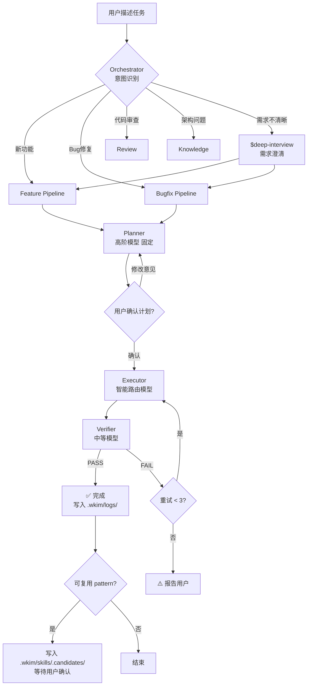
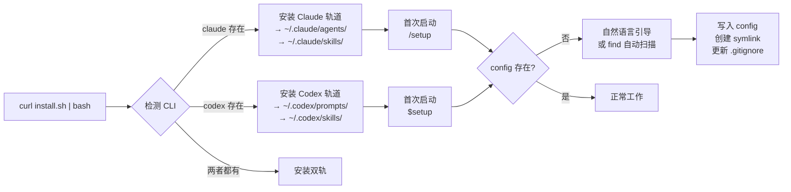
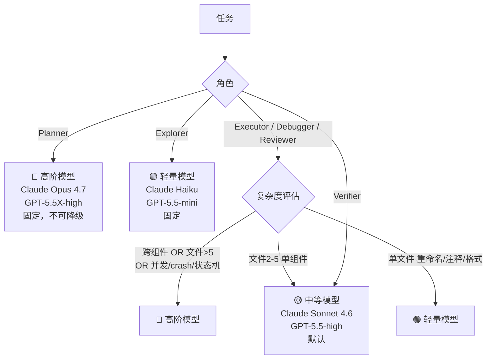
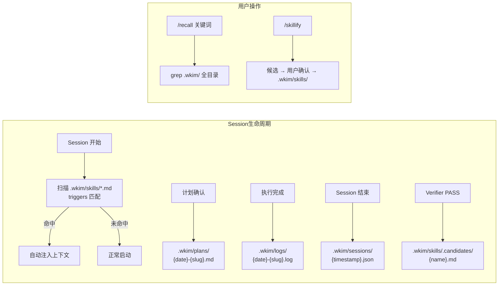

# wk-im-developer v2

专门负责 BTIMService 和 BTIMModule 两个 iOS CocoaPods 组件的开发者 Agent。

双轨架构：**Claude 轨道**（借鉴 [oh-my-claudecode](https://github.com/Yeachan-Heo/oh-my-claudecode)）+ **Codex 轨道**（借鉴 [oh-my-codex](https://github.com/Yeachan-Heo/oh-my-codex)）。

---

## 运行原理

### 核心流水线

每个开发任务都经过四个阶段：**规划 → 确认 → 执行 → 验证**。



### 安装流程



### 模型路由决策



### 记忆系统数据流



---

## 安装

### 前置依赖

- Xcode 15+ / CocoaPods 1.14+ / Python 3.9+
- Claude Code CLI 或 Codex CLI（至少一个）

### 一行安装

```bash
curl -fsSL https://raw.githubusercontent.com/<org>/wk-im-developer/main/install.sh | bash
```

脚本自动检测已安装的 CLI，安装对应轨道（或双轨）。

### 首次初始化

安装后，在 session 中运行：

```bash
# Claude 轨道
/setup

# Codex 轨道
$setup
```

Agent 会引导你：
1. 输入 BTIMService / BTIMModule 路径，**或**提供父目录自动扫描
2. 自动创建 symlink 和配置文件
3. 自动将 `.wkim/` 加入 `.gitignore`

---

## 使用方式

### Claude 轨道（`/skill` 触发）

```bash
claude  # 自动进入 wk-im-developer 模式
```

| 命令 | 说明 |
|------|------|
| 直接描述任务 | 自动路由到对应 pipeline |
| `/setup` | 初始化工作区 |
| `/doctor` | 环境健康检查 |
| `/plan <任务>` | 规划并确认后执行 |
| `/review` | 审查当前 diff |
| `/recall <关键词>` | 搜索历史记忆 |
| `/skillify` | 提取可复用 pattern |

### Codex 轨道（`$keyword` 触发）

```bash
codex  # 进入 wk-im-developer 模式
```

| 命令 | 说明 |
|------|------|
| `$deep-interview "..."` | 需求澄清（苏格拉底式） |
| `$ralplan "..."` | 共识规划（Planner→Architect→Critic） |
| `$ralph "..."` | 持久执行+验证循环 |
| `$setup` | 初始化工作区 |
| `$doctor` | 环境健康检查 |
| `$recall <关键词>` | 搜索历史记忆 |
| `$skillify` | 提取可复用 pattern |

### 典型工作流

```
# 需求清晰时
你: 支持消息撤回，2分钟内可撤回
→ Planner 探索代码，输出计划
→ 你确认计划
→ Executor 实现
→ Verifier 验证通过

# 需求模糊时（Codex）
$deep-interview "我想改进消息状态"
→ 澄清后
$ralplan "实现消息已读回执"
→ 确认后
$ralph "执行消息已读回执计划"
```

---

## 架构约束

| 规则 | 说明 |
|------|------|
| BTIMService MUST NOT import BTIMModule | 依赖方向单向 |
| BTIMModule MUST NOT import ThirdPartyIMSDK | SDK 访问只在 BTIMService adapter 层 |
| 只修改 workspace/Components/ 下的两个组件 | Scope 保护 |
| 不在日志中暴露 message body / token / cookie | 隐私保护 |
| Public API 变更必须更新 contracts.md | 契约治理 |

---

## 模型配置

默认配置（可通过 `~/.wk-im-developer/models.json` 覆盖）：

| 角色 | 默认模型 | 说明 |
|------|----------|------|
| Planner | Claude Opus 4.7 / GPT-5.5X-high | 固定高阶，不可降级 |
| Executor (高复杂度) | Claude Opus 4.7 / GPT-5.5X-high | 跨组件/并发/crash |
| Executor (中复杂度) | Claude Sonnet 4.6 / GPT-5.5-high | 默认 |
| Executor (低复杂度) | Claude Haiku / GPT-5.5-mini | 单文件简单修改 |
| Verifier | Claude Sonnet 4.6 / GPT-5.5-high | |
| Explorer | Claude Haiku / GPT-5.5-mini | 固定轻量 |

---

## 目录结构

```
wk-im-developer/
├── claude/                    # Claude 轨道（OMC 风格）
│   ├── install.sh
│   ├── agents/                # Orchestrator + Planner + Executor + Verifier + Explorer
│   ├── skills/                # setup / doctor / plan / feature / bugfix / review / recall / skillify / knowledge
│   ├── hooks/scope-check.py
│   └── settings.json
├── codex/                     # Codex 轨道（OMX 风格）
│   ├── install.sh
│   ├── prompts/               # planner / executor / verifier / explorer / code-reviewer / debugger / architect
│   ├── skills/                # deep-interview / ralplan / ralph / setup / doctor / build-fix / code-review / recall / skillify
│   ├── AGENTS.md
│   └── config.toml
├── shared/                    # 共享脚本
│   ├── scripts/               # verify.sh / guard.sh
│   ├── hooks/scope-check.py
│   └── model-router.md
├── .wkim/                     # 记忆持久化（gitignored）
│   ├── plans/                 # 历史计划
│   ├── logs/                  # 执行日志
│   ├── skills/                # Learned patterns（自动注入）
│   │   └── .candidates/       # 待确认候选
│   └── sessions/              # Session 摘要
└── install.sh                 # 一行安装入口
```
